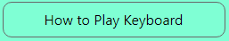
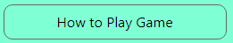

# User Interactive Project Piano/Simon Game

This project represents a website the main focus of which is a piano keyboard. It allows users to play simple tunes as well as play a game called Simon.
The piano has a 15-key keyboard with notes from C(middle C or C4) to D(D5) with their name written on the white keys.
the Simon game is a memory game. The main object of the game is correctly repeat a sequence of keys, which become longer and longer with each level. 
This website built for educational, memory training and entertaiment purpose.

## UX

This website target audiences are those who wish to play piano and learn basic notes in a fun easy way. The website is suitable for children as it is interactive and colourful. The notes on the keys makes it easy to read and memorise. The game mode of the piano helps with the practice of music hearing and memory at the same time.

#### User story:
**1. Keyboard**
  * User presented with a set of piano keys and buttons.
  * User can read how to play keyboard by pressing  button.
  * Any time user presses the key it lights up and plays a sound corresponding to the piano note.
  * At any time user can choose to play game by pressing  button.

**2. Game**
  * The user presented with a set of piano keys and buttons.
  * User can read how to play game by pressing  button.
  * To start the game user will press the  button.
  * The user presented with series of random key lit-ups and can hear sound that corresponding to each key.
  * Each time the user presses a key it lights up and plays a sound.
  * When the correct series of keys are pressed, the user can see the same series of key lit-ups but with additional key.
  * If the wrong key is pressed, the user get notified by a beeping sound and a triple exclamation mark in the level button . 
  Series of key lit-ups are repeated to remind the user of the pattern so that the user can try again.
  *In the level button user can see how many steps are in the current series of keys.
  * The "Restart" button  allows the user to restart the game.
  * The user can win the game by repeating 20 series of keys correctly. The user get notified of the victory by a cheering sound and a text "YOU WON!!!" in the level button .
  *  At any time user can choose to play keyboard by pressing  button. 

**3. Contact**
  * The user presented with contact form.
  * If the user wants to contact website creator user can complete the form by filling in all the required fields and pressing   button.
    
## Features

#### Existing Features

* Header drop-down menu;
* Button-links;
* User interactive piano keyboard;
* Plays audios;
* Footer links to website pages;
* Contact form is connected to email service;
* Mobile-ready version - Responsive website design;
* Social media integration.  There are Icons/links in the Footer to social media accounts of the website creator.

#### Features Left to Implement

* Social media links;

## Technology Used

* HTML5;
* CSS3;
* Bootstrap (v4.1);
* Javascript;  
* JQuery;
* Visual Studio Code;
* GitHub;

## Testing
* The HTML code was checked with online validator:(https://validator.w3.org/#validate_by_input);
* The CSS code was checked with online validator: (https://jigsaw.w3.org/css-validator/#validate_by_input);
* The Javascript code was checked with online validators: (https://www.jslint.com/), (https://jshint.com/);
* Responsiveness was checked with online validator: (https://www.responsinator.com/);
* The Chrome Developer Tools was used to check website for responsiveness and its console to check Javascript. 

## Deployment

This project was addited in Visual Studio Code, pushed from AWS Cloud9 and stored in GitHub repository. To deploy a website to the public Internet we are using GitHub's free service called GitHub Pages.
Deployment of the website was done from GitHub repository of the project by clicking the "Settings" and choosing "master branch" from the dropdown menu in "Source" section within "GitHub Pages" section.  
[Click to view website.](https://digitalis75.github.io/User-Interactive-Project-Piano-Simon-Game/).  
 The website get automatically updated with every change in repository. 

## Credit

#### Content
* [Google fonts](https://fonts.google.com/?category=Serif&query=roboto);  
* [Font Awesome](https://fontawesome.com/);

#### Code
* Header dropdown menu: https://www.w3schools.com/howto/howto_js_collapse_sidebar.asp;
* Canvas: https://www.w3resource.com/html5-canvas/html5-canvas-gradients-patterns.php, https://www.w3schools.com/html/html5_canvas.asp;
* How to play buttons:
* Keyboard: https://www.youtube.com/watch?v=Cxz8kj3U6PQ&t=118s;
* Game: https://www.youtube.com/watch?v=4pfvy_A5ceE, https://www.youtube.com/watch?v=9MTR3V2XpRI, https://www.youtube.com/watch?v=iXscqYgZ7HQ&t=621s;

#### Images
Background image: https://www.shutterstock.com/image-vector/vector-background-colorful-hands-339652463;
 

#### Media 
  * Keyboard key sounds: https://drive.google.com/file/d/1iKVL4MMMw9ur2h3HUDA-_qwnehT3Z2M1/view;
  * Beep sound: https://www.soundjay.com/beep-sounds-1.html;
  * Winner sound: https://www.freesoundeffects.com/free-track/happykids-426842/

#### Acknowledgements 
* Video tutorials of Code Institute and examples of introduced code;
* HTML, CSS, Bootstrap4, JavaScript, jQuery tutorials at [w3schools.com](https://w3schools.com/);  
* [Bootstrap Documentation](https://getbootstrap.com/docs/4.3/getting-started/introduction/);
* [Markdown Cheatsheet](https://github.com/adam-p/markdown-here/wiki/Markdown-Cheatsheet);
